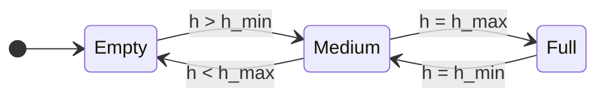
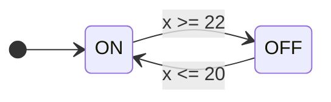
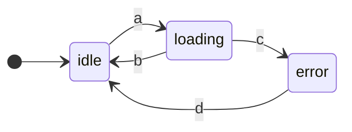

> [!summary] Index
> Lezione successiva: [[02-formal_languages]]

# Dynamical Systems and Mathematical Models

A dynamical system changes with time following some set properties and a mathematical model that describes its evolution. They are different from neural-network as the latter are data-driven, instead of being dependent on a formula.

# Time Driven Systems

## Continuous Time-Driven System

Change depending on time only, described by differential equations. The independent variable is time $t \in R$.

$$
x(t) = f(x(t), u(t))
$$
with $x(t) \in R^n$ being the state, and $u(t) \in R^n$ being the input at time $t$.

An example is a _tank_:

$$
\frac{d}{dt}V(t) = q_1(t) - q_2(t)
$$

with $v$ being the volume as the **state**, and $q_1,q_2$ the in/out flow of the pump.
In this case, the state is only dependent on the time variable $t$, and is calculated as the difference between the _input_ flow at $t$ and the _output_ flow at the same time.

## Discrete Time-Driven System

Same as above, but the variable $t$ is _discrete_ $t \in Z$:

$$
x(k + 1) = f(x(k), u(k))
$$

These are described by a system of difference equations.

The two systems are strictly related. 

If the timing is known a priori the model is called **non-stochastic**, otherwise it is **stochastic**.

The two systems are not intrinsically distinct: a system might change from an event one to a time one.
For example: taking the tank case from before, we want to guarantee that a level of the liquid stays between the interval $[h_{min}, h_{max}]$. We can use a supervisor to control the pumps so that it works like this:
* The input of $q_1$ is blocked when $h_{max}$ is reached
* The output of $q_2$ is blocked when $h_{min}$ is reached

This system is defined by the following FDA:

## Hybrid system

An hybrid system is a system that is both time-driven and event-driven.

An example might be a thermostat. We want to keep the temperature $x(t)$ between $T_{ON} = 20°C$ and $T_{OFF} = 22°C$, with a heat pump. The temperature of the environment might be $T_E < T_{ON}$, meaning that the temperature decreases spontaneously when the pump is off.
This means that we have a **differential equation** to describe the variation of the temperature when the pump is on:

$$
x = -k[x-T_e] + q
$$

and another one for when it is off:

$$
x = -k[x-T_e]
$$

The change between these two states is defined by the events of the temperature being above or under $22°C$:

Because this system is both time-driven and event-driven, it is called _hybrid_.

# Event driven Systems

The space of the states is _discrete_. These systems do not take time into consideration, but only the _states_ and the _transitions_.

An example is a robot which has three states: 
* _idle_
* _loading_
* _error_

These states are purely logical, not numerical, and the events that drive the states are not dependent on time. For example, they might be:
* $a$: the robot takes a part
* $b$: part loaded correctly
* $c$: part incorrectly positioned
* $d$: part repositioned

# Formal Languages

> [!warning] Note from the professor
> Pay attention to the notation!

A set of strings of symbols with a set of rules. The set of symbols is called _alphabet_. We use formal languages to describe the evolution of dynamical systems.

## Alphabet and Words

Finite and non empty set of symbols, with a cardinality of $|E|$. Some examples:

$$
E_1 = \set{0, 1},\ \ \ \ \ \ \ E_2 = \set{a,b,c,...,x,y,z}
$$
A **word** $w$ is a sequence of symbols of $E$. The length of a word is $|w|$, while $|w|_e$ counts the occurrences of the symbol $e$ inside $w$. Some examples:

$$
w_1 = 0001111 \text{ defined on } E_1 \rightarrow |w_1| = 5, |w_1|_0 = 3
$$
$$
w_2 = hello \text{ defined on } E_2
$$

The empty word has length zero, and is defined  on all alphabets. It is denoted by the symbol $\epsilon$.

The set of all words of an alphabet $E$ is $E^*$, called _Kleene Star_ (or _Kleene closure_). This set is infinite, in contrast to $E$ which is finite. If a word is part of an alphabet we say that $w \in E^*$.

### Operators

#### Concatenation

Given $w_1 \in E^*$ and $w_2 \in E^*$, $w = w_1 \cdot w_2 \in E^*$ is defined as the _concatenation_ of $w_1$ and $w_2$. For example:

$$
w_1 = aa, w_2 = bb, w = w_1 \cdot w_2 = aabb
$$

> [!info] Properties:
> * Associativity: $(w_1w_2)w_3 = w_1(w_2w_3)$
> * Non-commutativity: $w_1 = ab, w_2 = cd \rightarrow abcd \neq cbad$
> * The identity element is the empty word $\epsilon$: $w\epsilon = w$
> * Repetition: if $k$ identical symbols are concatenated we indicate the final result as $e^k$ : for example, $aabbb = a^2b^3$. The empty word can be written as $e^0 = k$

If we have a word $w \in E^*$ that can be written as $w=uvz$, with $u,v,z$ being words in the language $E$, then:
* $u$ is called a _prefix_
* $v$ is called a _substring_
* $z$ is called a _suffix_

For example, having $w = abcd$:
* The prefixes are $P = \set{\epsilon, a, ab, abc, abcd}$
* The suffixes are $S = \set{\epsilon, d, cd, bcd, abcd}$
* The substrings are all its prefixes, suffixes, and the words $\set{b, c, bc}$

#### Projection

Given $w \in E^*$ and a subset alphabet $\hat{E} \subseteq E$ the projection of $w$ on $\hat{E}$ is the word obtained from $w$ all symbols not in $\hat{E}*$. For example, if:

$$
E = \set{a, b, c}\ \ \ \hat{E} = \set{a,b}
$$

given $w= abccacba$, we have $w \uparrow \hat{E} = ababa$.